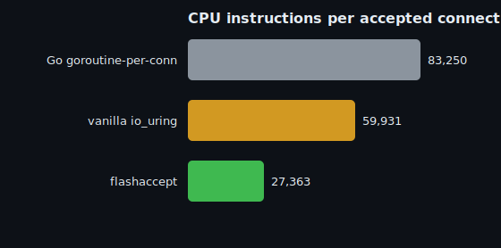

# Benchmarks

`flashaccept` accepts each TCP connection for far fewer CPU instructions than both a
goroutine-per-connection Go server and a vanilla io_uring server.

## Headline (CPU per connection)

Measured on **loopback, one pinned core, CPU-bound, fixed 512 in-flight connections, 3 reps,
~2–3% run-to-run spread**. Loopback is used deliberately: it removes network-condition noise so the
number reflects *CPU cost per connection*, not link jitter.

| server | instructions / connection | conn/s (1 core) | vs Go | vs vanilla io_uring |
|---|---:|---:|---:|---:|
| Go, goroutine-per-connection | 83,250 | 60,131 | 1.00× | — |
| vanilla io_uring (re-armed single-shot accept) | 59,931 | 147,946 | 1.39× | 1.00× |
| **flashaccept** | **27,363** | **361,282** | **3.04×** | **2.19×** |

- **vs the Go path:** 3.04× fewer instructions/connection → ~6.0× the connections/sec on one core.
- **vs vanilla io_uring:** 2.19× fewer instructions/connection → ~2.4× the connections/sec.

### Why "instructions per connection"?

It's the cleanest proxy for "CPU cost to accept a connection": an exact hardware counter,
frequency-independent (immune to turbo/thermal drift), and directly what determines CPU at a
target connection rate. Throughput (conn/s per core) tracks it when the core is saturated.

## What makes it fast

| technique | effect |
|---|---|
| multishot accept (`io_uring_prep_multishot_accept`) | one SQE yields many accept completions — far fewer submissions |
| registered files / direct descriptors | accept into the ring's descriptor table; skip fd-table lookups/churn |
| per-worker connection freelist | no per-connection `malloc`/`free` on the hot path |
| `MSG_MORE` reply+FIN fusion | cork the reply so `close()`'s FIN piggybacks — two TCP segments + NIC doorbells become one |
| batched submit/harvest | one `io_uring_enter` drives many connections |
| one ring + `SO_REUSEPORT` socket per worker | kernel load-balances accepts; no cross-core sharing |

At the champion operating point the CPU is ~94% kernel TCP / ~1% user / ~4% liburing — i.e.
flashaccept's own overhead is nearly gone; what remains is the kernel's (irreducible) TCP work.

## Environment

Intel Xeon Gold 6154 @ 3.0 GHz, Linux 6.8, liburing 2.5, gcc 13. Single host, loadgen pinned to
separate cores from the SUT.

## Caveats (read these before quoting numbers)

- **Loopback, CPU-bound.** These are per-core CPU-efficiency numbers. Absolute throughput on real
  hardware over a real NIC will differ; the *ratios* are the durable result.
- The development rig measured the SUT over a real (cross-datacenter) network link too, where
  connection-churn measurements are noisy (±10–20%); those are **not** the basis for the numbers
  above. See `research/` for the full methodology and the two-box "Track B" plan for
  measurement-grade throughput.
- Reproduce everything with `research/scripts/setup.sh` + `research/harness/`.
